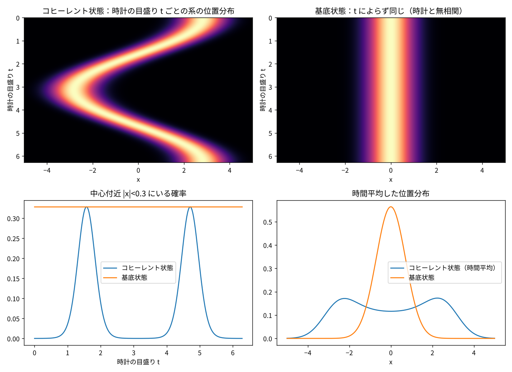

# ペイジ＝ウッターズ模型による「中心の通過」の検証

「存在のトポロジー：格子拘束・運動・境界から導く宇宙の法則」第2節（運動による存在の定義）の描像を、ペイジ＝ウッターズ（PW）の時間の枠組みと突き合わせ、数値模型で確認した記録。

- 作成：川上真潔（Kawakami Naoyuki）
- 日付：2026-10-09
- 位置づけ：作業仮説の検証記録（PW 部分は既存の確立した枠組み、対応づけは本記録の解釈）

---

## 1. 問い

文書第2節では、単振動の中心を「存在が滞在する場所ではなく、極性を反転させる変換のゲート」とした。これに対し、量子調和振動子の基底状態では粒子は中心で最も見つかりやすく、主張と逆になる。

本人の補足：中心は「動いている時間の中では何もとどまらない場所」であり、時間の流れと双極の場の関係として読むべきである。また、時間が理解しにくいのは見方の「中」と「外」が区別されていないためで、観測者の原点を定めれば整理できる。

この「中と外」を式として持っているのが PW の枠組みなので、両者を対応づけ、どこまで一致し、どこが修正を要するかを数値で確かめる。

## 2. PW の枠組み（要約）

宇宙全体を時計 C と系 S に分け、全体の状態に次の拘束を課す。

$$(H_C + H_S)\,|\Psi\rangle = 0$$

全体のエネルギーはゼロで、全体の状態は時間変化しない（外から見て静止）。時計が t を指すという条件で系を見ると

$$|\psi(t)\rangle = \langle t|_C\,|\Psi\rangle$$

が通常のシュレーディンガー方程式に従う（中から見て運動）。

## 3. 描像との対応

| 存在のトポロジー | PW | 一致の程度 |
|---|---|---|
| 総和エネルギー０の運動・双極の０ | 系が E を持てば時計は −E を持ち、全体がゼロになる拘束 | よく一致 |
| 中心の通過（変換のゲート） | 時計の目盛りと「波束が中心にあること」の相関。外から見れば通過という出来事は無い | よく一致 |
| 基底状態で運動が位相へ移る | 基底状態では系と時計が無相関。位相の回転は観測できない全体位相にすぎない | **修正が必要**（下記） |
| 見る原点を定める | 何を時計に選ぶか | よく一致 |

### 「位相への移行」の修正

基底状態では全体の状態が

$$|\Psi\rangle = |E_0\rangle_S \otimes |{-E_0}\rangle_C$$

という積になり、系と時計の相関が消える。系の位相回転は時計の目盛りの写しにすぎず、系自身の運動とは言えない。

ただし「ゼロに落ちない」は保たれる。零点エネルギー $E_0 = \hbar\omega/2$ がゼロでない以上、時計は $-E_0$ を背負い、系と時計の双極の対は解消できない。したがって次のように書き改める。

> 空間の往復が消えるとき、存在は「運動」としてではなく、「対の極を必ず持つこと」として維持される。

## 4. 数値模型

- 系 S：調和振動子（ħ = m = ω = 1、$E_n = n + 1/2$）、40準位で打ち切り
- 時計 C：固有エネルギー $\varepsilon_n = -E_n$ を持つ40準位の理想時計
- 全体：$|\Psi\rangle = \sum_n c_n |E_n\rangle_S \otimes |{-E_n}\rangle_C$
- 比較する2状態：コヒーレント状態（α = 2、往復する波束）と基底状態
- 「中心付近」：|x| < 0.3

### 結果

| | コヒーレント状態（α=2） | 基底状態 |
|---|---|---|
| 拘束の残差 ‖(H_C+H_S)Ψ‖ | 0 | 0 |
| 系と時計のもつれエントロピー | 2.09 | 0 |
| 時計の目盛りに対する ⟨x⟩ の振れ幅 | 5.65 | 0 |
| 中心付近にいる確率（最小／最大／時間平均） | 0.0002 ／ 0.329 ／ 0.070 | 0.329（一定） |
| 時間平均した位置密度 | x=0 で 0.116、最大は x≈±2.24 で 0.173 | x=0 で 0.564（最大） |



### 読み取り

1. **外から見て静止**：両状態とも拘束は厳密にゼロで、全体は時間を持たない。
2. **中心の通過**：コヒーレント状態では、中心にいる確率は通過の瞬間だけ立ち上がり、他ではほぼゼロ。時間平均の位置分布は中心でくぼむ。「動いている時間の中では中心に何もとどまらない」が、時計との相関として成り立つ。
3. **基底状態**：時計とのもつれはゼロ。どの目盛りでも分布は同じで、中心で最大。この時計に対して系の時間は流れていない。
4. **通過の瞬間と基底状態の一致**：コヒーレント状態が中心を通過する瞬間の中心確率（0.329）は、基底状態の値と一致する。コヒーレント状態は基底状態の波束を平行移動したものなので、通過の瞬間は形が同一で、違いは運動量だけである。
   > 中心のゲートを通る瞬間、存在は基底状態と同じ姿をとる。止まっているか通過しているかを分けるのは、時計との相関だけである。

## 5. 何が既知で、何が新しいか

- **既知（PW が既に持つもの）**：総和ゼロの拘束、外から静止・中から運動、時計の選択による原点の決定。
- **本描像に固有のもの**：中心と外郭の相補性、格子拘束、自己相似。PW には幾何が入っておらず、時計と系の分け方（境界をどこに引くか）を問わない。
- **新しさになり得る方向**：時計と系の境界の引き方を第3節の「外郭」と結びつけ、境界の取り方によって何が観測されるかを示すこと。

## 6. 限界

- 時計は系と同じ準位構造を持つ理想化された時計で、相互作用は入れていない。
- 40準位の打ち切りは α = 2 には十分（平均準位数 4）だが、大振幅では増やす必要がある。
- 本模型は PW の既知の性質を再現したもので、描像の新しい予言はまだ含まない。

## 7. 次の課題

- 時計と系に弱い相互作用を入れ、相関（時間の流れ）がどこで崩れるかを調べる。PW の既知の弱点（時計と系が相互作用すると時間発展が崩れる）に対し、双極の０の描像が何か言えるかを確かめる。
- 同じ時計で2回測ったときの問題（クハーシュの批判）を模型で再現する。
- 時計と系の分割の仕方を変え、「外郭」の取り方と観測される運動の関係を見る。

## 8. 実行方法

```bash
pip install -r requirements.txt
python3 pw_center_passage.py
```

標準出力に結果の数値、`pw_center_passage.png` に図を出力する。日本語フォントとして Noto Sans CJK JP を使う（無い場合は代替フォントにフォールバック）。

## 参考文献

- D. N. Page and W. K. Wootters, "Evolution without evolution: Dynamics described by stationary observables," *Phys. Rev. D* 27, 2885 (1983).
- V. Giovannetti, S. Lloyd, L. Maccone, "Quantum time," *Phys. Rev. D* 92, 045033 (2015).
- K. V. Kuchař, "Time and interpretations of quantum gravity," in *Proc. 4th Canadian Conference on General Relativity and Relativistic Astrophysics* (1992).
- C. Rovelli, "Relational quantum mechanics," *Int. J. Theor. Phys.* 35, 1637 (1996).
