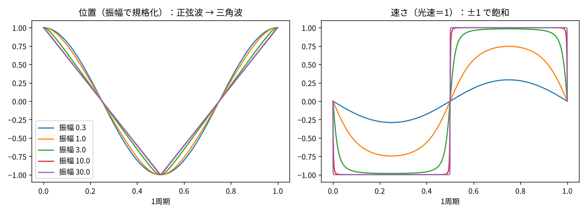

# TTT 検証ノート 2026-10-09 (2/2)：誕生・光速での飽和・回転する直線・質量と慣性

- 著者：川上真潔（Kawakami Naoyuki）／照合：Claude
- 検証スクリプト：`f_saturation.py`（numpy のみ、28 assert 全通過）、図 `rel_osc.png`
- 前提：2026-10-09 (1/2) ノート（F の発生）、2026-10-05 ノート（34 ＝ 16 ＋ 18、鉄の山）、2026-10-07 ノート（OOOπ、慣性と重力）
- 位置づけ：理論考察の途中経過。主張・照合結果・未解決事項を区別して記録する

## 0. 結論

| 判定 | 項目 |
|---|---|
| ADOPTED | 球 2·3^(n−1) が立方体 n³ を段2以降で初めて上回るのは段5（125、はみ出し37）。連続で解くと一辺 ≈ 4.44 で交わる |
| ADOPTED | 光速に近づく単振動は、速さが光速で飽和し、波形が正弦波から三角波に変わる。周期は 4A/c に近づく |
| ADOPTED | 先端が光速になるよう回る直線のエネルギーは E ＝ (π/2)·T·R（静止時の π/2 倍）、角運動量 J ＝ E²/(πT) |
| ADOPTED | 6点 (±1,0,0), (0,±1,0), (0,0,±1) の3点を同時に光速で回せる軸は体対角線だけ。直線は 54.74° の円錐を描き、＋と−の開きは正四面体の中心角 109.47° |
| ADOPTED | 光速の円運動では F ＝ mA と E ＝ mc² から F ＝ E/R（c は消える）。直線では F ＝ T ＝ (2/π)·E/R |
| ADOPTED | 曲線運動は F ＝ γmA、直線運動は F ＝ γ³mA。直線運動では力は速さを上げずエネルギーとしてたまる |
| CONSISTENT | 飽和した殻を破るのは F：F ＝ E/R が殻の張力に達したとき誕生（弦の切断と同じ形） |
| CONSISTENT | 格子の釣り合いで質量拘束が起きる ↔ インフレーションの終わり（再加熱）で物質が生まれる |
| REVISED | 「誕生時に受けた力を運動として保存する」→「内部運動のエネルギー（静止エネルギー）として保存する」 |
| CONSISTENT | まとまると運動が打ち消し合い光や熱になる ＝ 結合エネルギー（質量欠損） |
| ADOPTED | 結合エネルギーの山（鉄・ニッケル付近）は、体積より速く増える反発の項（A^(5/3)）で生じる。この項を除くと山は消える |
| OPEN | 静止した二つの質量の引力（1/r²）を慣性と空間の歪みから導く |
| OPEN | 回転する直線と弦の張力 T の値（尺度）を構造から出す |

## 1. 球の数列と格子（Block 1）

本人の提示：1×1×1 に球2、2×2×2 に球6、以後 ×3 で増える。5×5×5 ＝ 125 のとき球は 162 で 37 が余る。球と格子の力のバランスの限界点は 125。

| 段 | 立方体 | 球 | 球 − 立方体 |
|---|---|---|---|
| 1 | 1 | 2 | +1（誕生） |
| 2 | 8 | 6 | −2 |
| 3 | 27 | 18 | −9 |
| 4 | 64 | 54 | −10 |
| 5 | 125 | 162 | **+37** |
| 6 | 216 | 486 | +270 |

- 段1で球が上回り（誕生）、段2〜4で格子が抑え、段5で再び球が上回る（以後は指数が勝ち続ける）。
- 倍率 ×3 は「親が残り、双極の子が2つ生まれる（1＋2）」と読む。
- 37 は初項2と倍率3で決まる。37 の内訳（16＋18＋3）は 10-05 ノートで解析済み。

## 2. 誕生の描像（本人の提示）

- 双極の場であり、その双極の境界が XY 平面である。歪みが双極の場で起きる。
- 0 で双極に発生した＋と−は、Z 軸上で F が双方に加わり分かれた。
- ＋F と −F の点は直線の軌道で引き合い直線運動、B・I の点は軌道がないため曲線運動。
- FBI の3点は相互作用しながら、回転3つと単振動1つの運動が、抵抗のない中で光速の限界まで進む。
- 発生したものは F の点、B・I の点、0 と F を結ぶ直線の4要素。直線の作るエネルギーは、3点により作られ作る関係で、直線が回転するエネルギーである。
- F が Z1 なら B・I は X1・Y1。3点の＋−で6点。

照合：

- (1/2) ノートの結果（B と I が同じ面で逆向きに回ると F は軸上の単振動）で、その面が XY 平面、軸が Z に対応する。
- 既存の物理で同じ形を持つもの：場からの対生成（シュウィンガー効果：強い場で＋−が対で生まれ、場の向きに引き分けられる）、ヨーヨー模型（ルンド弦模型：光速の端点が直線でつながって往復する）、弦の切断（エネルギーが十分になると新しい対が生まれ 1 本が 2 本になる）、回転する弦（端点が光速で円運動する）。
- 抵抗がないだけでは速さは増えない。光速まで加速するにはエネルギーの流入が要る。この描像では XY 境界の歪みのエネルギーと読む。

## 3. 光速での飽和（Block 2）

相対論のまま単振動を計算（dp/dt ＝ −z、v ＝ p/√(1＋p²)、c ＝ 1）。

| 振幅 | 最大の速さ | 周期 ÷ (4×振幅) |
|---|---|---|
| 0.3 | 0.29 | 5.32 |
| 3 | 0.983 | 1.12 |
| 30 | 1.0000 | 1.001 |



- 速さは光速で頭打ちになり、エネルギーは上限なく増える。
- 波形は正弦波から三角波へ：光速のまま直線を走り、両端で折り返す。
- 飽和すると中心も他の点も同じ光速で通過し、変化は両端の折り返しだけで起きる。
- 弦模型（引き合う力が距離によらず一定）では最初から三角波。「単振動」と呼べるのは光速に遠い段階だけ。

## 4. 回転する直線のエネルギー（Block 3）

0 から長さ R の直線を、先端が光速になるよう回す。単位長さあたりの静止エネルギー（張力）を T とする。

$$E=\frac{\pi}{2}\,T R,\qquad J=\frac{\pi}{4}\,T R^2,\qquad J=\frac{E^2}{\pi T}$$

- 先端のエネルギー密度は発散するが、全体では有限で、静止時 T·R の π/2 倍。
- 増えた分 (π/2 − 1)·T·R が回転による内部運動のエネルギー。10-07 ノートの「π はその軸の内部運動エネルギー」に対応する。
- 先端が光速で動けるのは点が質量を持たないときだけで、エネルギーはすべて直線にある。点が直線の端を決め、直線の回転が点の運動を決める（「3点により作られ作る関係」）。
- J ∝ E² は、ハドロンのスピンと質量の2乗が一直線に並ぶ関係（レッジェ軌道）と同じ形で、観測と照らし合わせられる。

## 5. 6点の回転（Block 4）

| 回転軸 | X1・Y1・Z1 の回転半径 | 3点が同時に光速 |
|---|---|---|
| Z 軸 | 1, 1, 0 | ならない |
| 体対角線 (1,1,1) | √(2/3) ずつ | なる |

- 3点を対等に光速で飽和させる軸は体対角線だけ。(1/2) ノートの「F＋B＋I は体対角線の双対」と一致する。
- ＋の3点は軸上 +1/√3、−の3点は −1/√3 の二つの輪に乗る（10-07 ノートの「両端の円運動でリング」）。
- ＋は 0°・120°・240°、−は 60°・180°・300°：互い違いの三角形（正八面体を体対角線から見た形）。
- 直線は軸から 54.74° の円錐を描き、＋側と−側の開きは 109.47°（正四面体の中心角）。
- 1/3 回転ごとに X1→Y1→Z1 と入れ替わる（(1/2) ノートの e^{πu/3}）。
- 6本のエネルギーは 3π·T·R。

**表記**：F を Z1 の点の名前とし、回転軸の体対角線には別の記号を当てる。(1/2) ノートの OPEN「F の二つの意味」はこれで分けられる。

## 6. F と光速（Block 5）

本人の提示：F も光速に関係する。F ＝ mA、E ＝ mc² から F と光速の関係式ができる。

半径 R を光速で回るとき A ＝ c²/R、m ＝ E/c² として

$$F=mA=\frac{E}{c^2}\cdot\frac{c^2}{R}=\frac{E}{R}$$

- c は打ち消し合う。相対論でも F ＝ dp/dt ＝ pω（p ＝ E/c、ω ＝ c/R）で厳密に同じ。質量のない点にも使える。
- 直線では張力が力そのもので F ＝ T ＝ (2/π)·E/R。

| 運動 | 力と加速度 | 光速に近づくと |
|---|---|---|
| 曲線運動（向きだけ変わる） | F ＝ γmA | m の代わりに E/c² を使えば F ＝ mA のまま |
| 直線運動（速さが変わる） | F ＝ γ³mA | 加速度は 0 に近づき、力はエネルギーとしてたまる |

## 7. インフレーションと質量（照合）

本人の提示：

- 飽和した殻を破るのはこの F の力であり、誕生が繰り返されインフレーションが起きる。
- このインフレーションは格子の力の釣り合いで質量拘束が起きる。
- 質量は発生時に力を受けている。この力を質量は慣性のエネルギーとして持つ。引力ではなく、質量が生まれたときに受ける慣性が保存され、インフレーションで質量はこの慣性の力をため込みながら運動している。

照合：

- ✓ 殻を破る条件は「F ＝ E/R が殻の張力に達する」として式で書ける（弦の切断と同じ形）。
- ✓ インフレーション中に生まれた粒子は急膨張で薄まり、今ある物質はインフレーションの終わり（再加熱）に場のエネルギーから生まれる。「格子の釣り合いで質量拘束」はこれに対応する。中心に初めて質量が入るのは段5（10-05 ノート）で、球が格子を初めて上回る段と同じ。
- △ 力そのものは保存量ではない。残るのは運動量（力×時間）とエネルギー（力×距離）。運動量は膨張で 1/a に薄まり、インフレーション（少なくとも 10²⁶ 倍）でほぼ消える。したがって次のように言い直す。

> 質量は誕生時に受けた力を、外向きの運動ではなく内部運動のエネルギー（静止エネルギー mc²）としてため込む。これは膨張しても粒子1個あたりでは薄まらない。慣性とは、この内部のエネルギーが外から動かされることに抵抗する性質である。

- ？ 慣性だけでは静止した二つの質量の引力（キャベンディッシュの実験）を説明できない。内部運動のエネルギーが周りの OπO の空間を歪ませ、その歪みに沿って隣の質量が慣性運動する、という一段が要る（一般相対性理論の形。10-07 ノート U4）。

## 8. まとまると光と熱になる（Block 6）

本人の提示：質量はつながる、まとまることで運動を打ち消し合う。この時に光や熱エネルギーに代わっていった。

| まとまるもの | 出るエネルギー | 失われる質量 |
|---|---|---|
| 陽子＋中性子 → 重水素 | 2.22 MeV（ガンマ線） | 約 0.12% |
| 水素4つ → ヘリウム4 | 26.7 MeV（光と熱） | 約 0.71% |
| 陽子＋電子 → 水素原子 | 13.6 eV（光） | ごくわずか |
| ガスの重力収縮 → 星 | 失った位置エネルギーの半分が熱 | ― |

- ✓ 結合エネルギー（質量欠損）そのもの。全体の運動量は保存され、打ち消し合うのはばらばらの運動の向き。運動エネルギーは光や熱として運び出される。
- 光や熱に変わるのはごく一部で、大部分は質量として残る。
- 核子あたりの結合エネルギーは A ≈ 60 前後（鉄・ニッケル）で最大。重い核ではまとまるほどエネルギーを吸い込む。
- 10-05 ノート §7「山を作るには体積より速く増える損の項が要る」：原子核ではそれが陽子どうしの反発で A^(5/3) で増える。まとまる力（A）、表面の損（A^(2/3)）、反発の損（A^(5/3)）の釣り合いで鉄の山ができる。反発の項を除くと山は消える。

## 9. 未解決事項

| # | 内容 |
|---|---|
| U1 | 静止した二つの質量の引力（1/r²）を、内部運動のエネルギーと空間の歪みから導く |
| U2 | 直線の張力 T と長さ R の値（尺度）を構造から出す |
| U3 | 殻の張力の値と、F ＝ E/R が殻を破る閾値を球と格子の数列（段5）に結びつける |
| U4 | 鉄の山を作る反発の項を、球と格子の数え方の中で表す |
| U5 | B と I を逆向きに回す原因（(1/2) ノートから継続） |

## 再現

```
python3 f_saturation.py
```

## 参考文献

- J. Schwinger, "On gauge invariance and vacuum polarization," *Phys. Rev.* 82, 664 (1951)（場からの対生成）
- B. Andersson, G. Gustafson, G. Ingelman, T. Sjöstrand, "Parton fragmentation and string dynamics," *Phys. Rep.* 97, 31 (1983)（ルンド弦模型）
- Y. Nambu (1970), T. Goto, *Prog. Theor. Phys.* 46, 1560 (1971)（回転する相対論的な弦）
- C. F. von Weizsäcker, *Z. Phys.* 96, 431 (1935)（結合エネルギーの半経験式）
