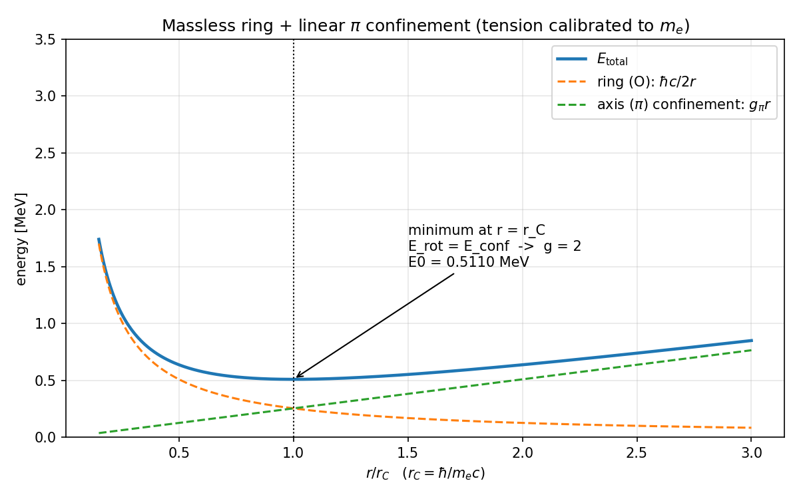
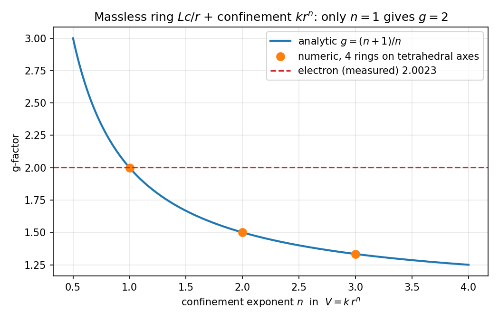
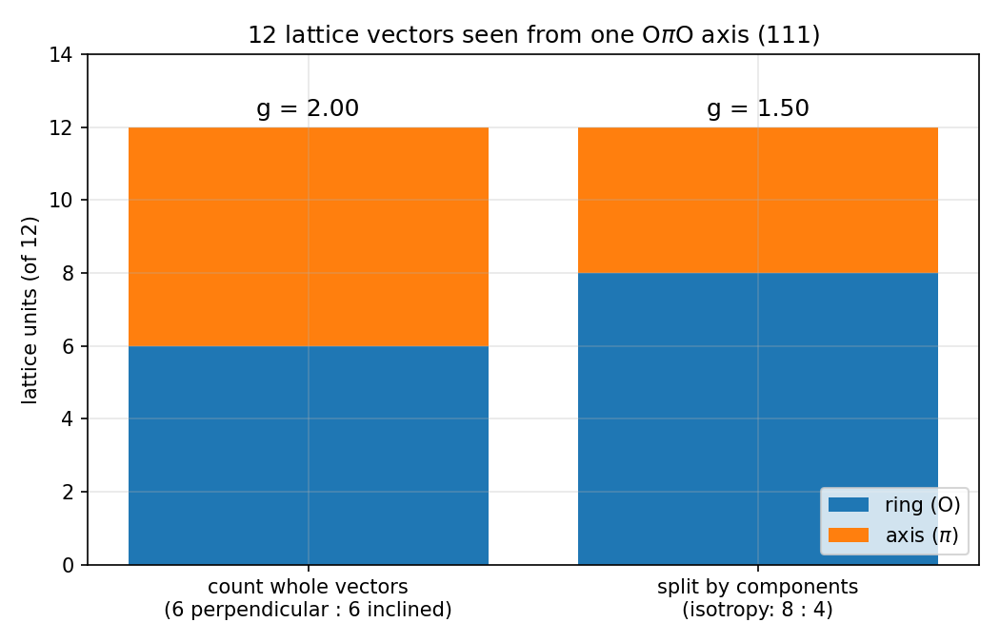
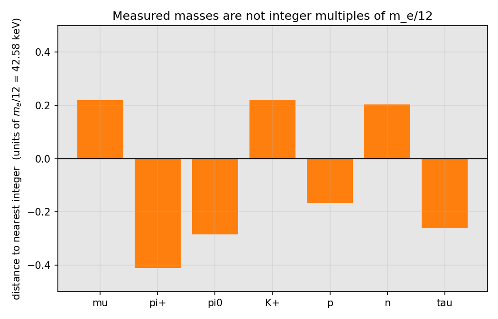
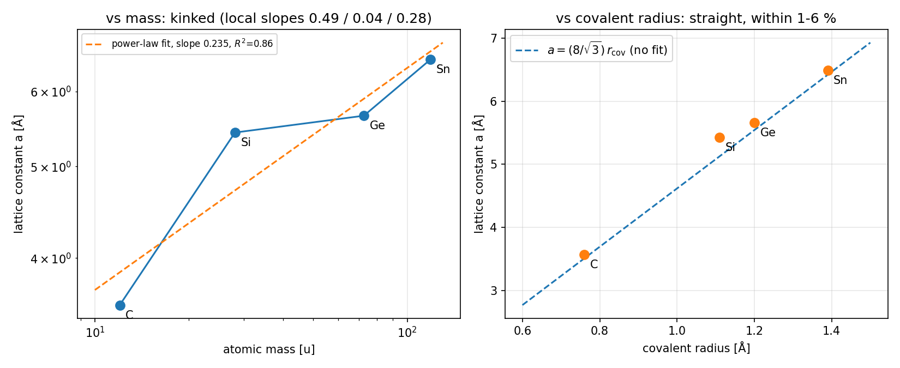
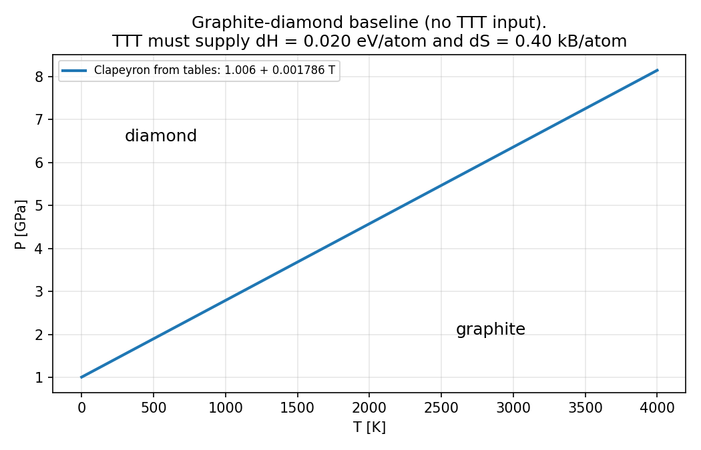

# TTT-physics（物理理論・検証の場）

**役割：** 唯一、実験と対峙するリポジトリ。ここが理論の「生死」を決める戦場です。本リポジトリの主張はすべて実験的に反証可能であることを原則とします。

## まずはこちら

**[`INDEX.md`](./INDEX.md)** — 公理系・ファイルマップ・全導出結果とCODATA/PDG観測値との比較表をまとめた総合インデックス。このリポジトリを読む最初の1本です。

## 導出ドキュメント

* [`fine_structure_derivation.md`](./fine_structure_derivation.md) → Alpha-V4：微細構造定数 $1/\alpha$ の級数を公理から導出
* [`proton_electron_ratio_derivation.md`](./proton_electron_ratio_derivation.md) → 陽子・電子質量比 1836 の一意性証明
* [`higgs_mass_derivation.md`](./higgs_mass_derivation.md) → ヒッグス質量 125.25 GeV の導出
* [`neutron_proton_splitting_derivation.md`](./neutron_proton_splitting_derivation.md) → 中性子・プロトン質量差 1.293 MeV の導出
* [`running_alpha_prediction.md`](./running_alpha_prediction.md) → 微細構造定数の高エネルギー走りの関数形
* [`experimental_predictions.md`](./experimental_predictions.md) → **最重要**。LHC・将来実験での予言一覧
* [`codata_comparison.md`](./codata_comparison.md) → 予言値と観測値の比較表（誤差評価つき、Python検証コード付き）
* [`falsifiability_criteria.md`](./falsifiability_criteria.md) → 反証条件・棄却プロトコルの明示
* [`verify_alpha_v4.py`](./verify_alpha_v4.py) → Alpha-V4の数値的一致を独立に再検証するスクリプト（公理からの導出の証明ではなく、既知の実測値への事後的な数値一致の再現であることを明記）
* [`TTT-physics.md`](./TTT-physics.md) → 探索ノート（素粒子17種のCoxeter群対応、スピン・重力・暗黒物質への推測段階のアイデア。まだ個別ファイルに昇格していない内容）
* [`GTM_v2.1_統合版.html`](./GTM_v2.1_統合版.html) → 125, 126, 128幾何学とAlpha V1〜V4のインタラクティブなシミュレーション

外部の物理学者が計算を再現できるよう、数式のLaTeXソースと簡易検証コード（Python等）を各ドキュメントに同梱しています。


# TTT-Core-Physics

**質量ゼロの光速リング（O）と軸（π）の拘束系として電子を読む ― TTT（Tri-Tetra Theory）コアの計算・検証ライブラリ**

[](https://github.com/kiki054-n/TTT-Core-Physics/actions/workflows/tests.yml)

TTT は、正四面体に配置された4つの $O\pi O$（O＝光速で回るリング、π＝光速で動く軸）を粒子の最小単位とみなし、その幾何から素粒子の質量、さらに炭素の結晶（ダイヤモンド・C60）までを一続きに説明しようとする理論です。

このリポジトリは、その主張を **Python で検算できる形** にまとめたものです。どの主張が導出済みで、どれが仮説で、どれが検算の結果否定されたかを区別して記録しています。数字を合わせるために実測値を入れた箇所は、すべて `src/ttt_core/constants.py` の一か所に集めてあります。

---

## 判定の水準

| 水準 | 意味 |
|---|---|
| **A 定理** | 物理と無関係に成り立つ幾何・算術 |
| **B 導出** | モデルの仮定から数式で導かれ、テストで確認済み |
| **C 仮説** | 形は立っているが、決め手の数がまだ導かれていない |
| **D 恒等式・反証** | 入力した数が戻っているだけ、または実測と合わない |

## 現状（2026-09-11 時点）

| 項目 | 水準 | 内容 |
|---|---|---|
| 質量ゼロの運動項 $Lc/r$ ＋ 線形拘束 $k r$ で g = 2 | **B** | 極小で回転と拘束のエネルギーが 1:1。一般に $V=kr^n$ なら $g=(n+1)/n$、g = 2 は $n=1$ のときだけ |
| 電子質量 → 張力 $k = m_e^2c^3/2\hbar = 0.1060$ N | **C** | 質量の問題が「この張力を何が決めるか」の一つに絞られた。張力はまだ実測から逆算している |
| 実測 Compton 半径から $m_e$ を再現（比 1.000） | **D 恒等式** | 半径を $m_e$ から作っているので、どの質量を入れても 1.000 |
| 12 本の格子ベクトル（正四面体の有向辺＝FCC 最近接） | **A** | 1 本の OπO 軸から見ると 垂直 6 本 ＋ 傾斜 6 本 |
| 格子 1 本 = $m_e c^2/12$ = 42.58 keV | **C** | 格子を不可分な単位として数える（6:6）なら g = 2 と両立。成分に分けると 8:4 で g = 1.5 |
| 整数個の格子で質量が決まる（加算則） | **D 反証** | μ, π, K, p, n, τ はどれも $m_e/12$ の整数倍から 0.17〜0.41 ずれる |
| 原子の軌道から電子質量 | **D** | $\hbar c/a_0 = \alpha m_ec^2$ = 3.73 keV。電子質量に届くには 1/α = 137 倍が要る |
| 109.47° は「4 本の和ゼロ」から必然 | **A（訂正）** | 和ゼロだけでは決まらない（正方形の反例）。「全対の角が等しい」を加えると決まる |
| C60 の五角形 12 個 | **A** | Euler 則でどのフラーレンでも 12 個。C60 に固有なのは六角形 20 個 |
| 37 殻 = 1 + 4 + 20 + 12 と C60 の対応 | **C** | 12 と 20 は正二十面体対称だが、4 が入ると対称性が T（位数 12）に下がる |
| IV 族の格子定数 $a \propto M^{\eta/D_f}$、$D_f=2.4$ | **D** | 4 点で折れ線（局所傾き 0.49 / 0.04 / 0.28）。$a$ は共有結合半径で 1〜6% 以内に決まる |
| 黒鉛–ダイヤモンド相図 | **C** | 線の形は熱力学の表だけで再現される。TTT が出すべきは $\Delta H$ = 0.020 eV/原子 と $\Delta S$ = 0.40 $k_B$/原子 |
| ダイヤモンド型 → 高圧相（Si, Ge, Sn） | **D** | 予測値が実測の 1/3〜1/4、転移線の傾きの符号が逆 |

詳しい数式は [`docs/FOUNDATIONS.md`](docs/FOUNDATIONS.md)、検算の経過は [`docs/VERIFICATION_LOG_2026-09-11.md`](docs/VERIFICATION_LOG_2026-09-11.md)、次に解くべき問題は [`docs/OPEN_PROBLEMS.md`](docs/OPEN_PROBLEMS.md) にあります。

---

## 中心の結果：電子のリングモデル

$$
E(r) = \underbrace{\frac{Lc}{r}}_{\text{リング O（質量ゼロ）}} + \underbrace{k\,r}_{\text{軸 π の拘束}},\qquad L=\frac{\hbar}{2}
$$

極小では $Lc/r = kr$、つまり回転のエネルギーと拘束のエネルギーが等しくなります。電荷が回転部分に乗っているとすると、磁気モーメントと角運動量の比から

$$
g = \frac{mc^2}{E_{\rm rot}} = 2
$$

が出ます。質量は $mc^2 = 2\sqrt{Lck}$ で、張力 $k$ だけで決まります。





## その他の図

| | |
|---|---|
|  |  |
|  |  |

---

## スケールの階層（作業仮説）

| 階層 | スケール | 内容 | 水準 |
|---|---|---|---|
| 地下 0 階 | 光速 $c$ | 質量ゼロの要素 O の運動 | 仮説 |
| 地下 1 階 | $\hbar/m_ec = 3.86\times10^{-13}$ m | π 拘束による電子（g = 2） | B（張力は C） |
| 地下 2 階 | 未導出 | $(O\pi O)_4$ の最小単位（109.47°） | C |
| 地下 3 階 | 未導出 | 125 コア ＋ 37 拘束殻 | C |
| 地上 | 0.154〜0.357 nm | 炭素の結合長・ダイヤモンド格子・C60 | 実測 |

地下 2 階・3 階の長さ（以前の版の 0.016 nm, 0.04 nm）は、式から導かれていないため数値を外しました。

---

## 使い方

```bash
pip install -r requirements.txt
pytest -q                          # 17 項目の検算（pytest がなければ python tests/run_tests.py）
python scripts/particle_comparison.py
python scripts/make_figures.py     # figures/ の図をすべて作り直す
```

## 構成

```
TTT-Core-Physics/
├── src/ttt_core/
│   ├── constants.py     実測値（CODATA 2018・PDG・熱力学表）をここだけに置く
│   ├── ring_model.py    リング＋拘束 → 半径 → 質量 → g 因子
│   ├── geometry.py      正四面体・12 本の格子・プラトン立体・フラーレン
│   └── comparisons.py   数え上げ規則と実測の比較
├── scripts/
│   ├── particle_comparison.py
│   └── make_figures.py
├── tests/               docs の主張を一つずつ検算するテスト
├── docs/                FOUNDATIONS / VERIFICATION_LOG / OPEN_PROBLEMS
└── figures/
```

## ライセンス

本リポジトリ（コード・文書・図）は **CC BY-NC-SA 4.0**（表示・非営利・継承）で公開します。理論の基礎部分は Zenodo 上で CC BY 4.0 として公開しています。詳細は [LICENSE](LICENSE)。

## 著者・引用

川上 真潔（Kawakami Naoyuki）― 独立研究者、長野県塩尻市
ORCID: [0009-0009-2972-6511](https://orcid.org/0009-0009-2972-6511)

引用情報は [`CITATION.cff`](CITATION.cff) を参照してください。検算コードの整備には Claude（Anthropic）を用いました。


